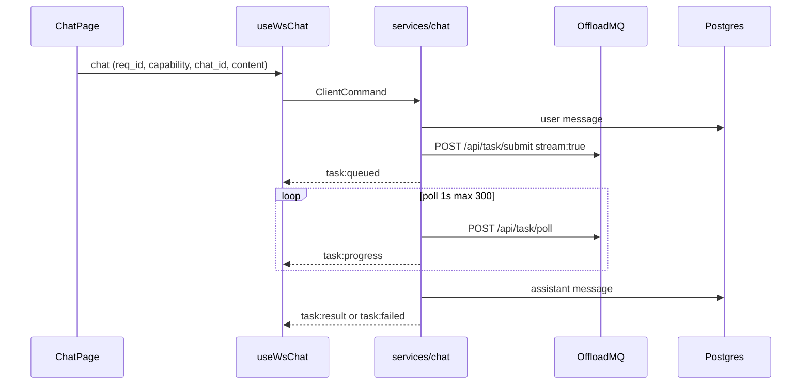

# OAI Chat — Engineering Context

End-user LLM chat at `/app/chat`. OAI backend owns auth, Postgres history, and a **WebSocket control plane**; **OffloadMQ** runs the actual `llm.*` tasks (submit + poll). Chat is **not** blocking on OffloadMQ urgent APIs.

**Related:** General OAI SPA layout → `.claude/skills/oai-frontend/SKILL.md`. Image jobs / global progress drawer share `ProgressContext` but are out of scope here.

---

## Running locally

```bash
# From oai/ — Postgres + backend :3001 + Vite :5174
task dev

task dev:backend    # cargo run only
task dev:frontend   # Vite only
task kill           # ports 3001/5173/5174 + infra
```

- Vite proxies `/api` (and WS) → `http://localhost:3001`
- OffloadMQ URL + client API key: **admin settings** in DB (`/app/settings/server`), not chat env vars
- JWT: `localStorage` key `oai_token`; WS uses `?token=` query param

---

## Architecture



**Dual persistence:** User message saved when WS `chat` is handled. Assistant row written only on **success/failure** in `poll_loop` — in-flight UI is client-only + `WorkloadContext`.

---

## Frontend file map

| Path | Role |
|------|------|
| `frontend/src/pages/ChatPage.tsx` | Main UI: sidebar, messages, send/cancel, WS subscriber, `mergeInFlightMessages` |
| `frontend/src/hooks/useWsChat.ts` | WS connect, reconnect, `send`, `subscribe`, capabilities on open |
| `frontend/src/types/ws.ts` | `ClientCommand` / `ServerEvent` (must match `backend/src/ws/events.rs`) |
| `frontend/src/contexts/WorkloadContext.tsx` | Cross-chat in-flight tasks (`reqId`, `chatId`, cap/id, stream, wsEvents) |
| `frontend/src/contexts/AuthContext.tsx` | `token` for REST + WS |
| `frontend/src/api/chats.ts` | CRUD chats + messages + PATCH system prompt |
| `frontend/src/api/systemPrompts.ts` | Library: recent (3), starred, use/star/delete |
| `frontend/src/api/tasks.ts` | `cancelOffloadTask` |
| `frontend/src/api/debug.ts` | `fetchOffloadPoll` |
| `frontend/src/components/chat/SystemPromptStudio.tsx` | Empty-thread editor + library; `DEFAULT_PROMPT` |
| `frontend/src/components/chat/SystemPromptBlock.tsx` | In-thread read-only prompt (markdown, no frame) |
| `frontend/src/components/chat/ChatMessageItem.tsx` | Transcript row; copy + **Listen** (`SpeechListenWidget`) on assistant messages; renders `MessageAttachments` |
| `frontend/src/components/chat/MessageAttachments.tsx` | Transcript image thumbnails + document chips |
| `frontend/src/components/chat/DocumentReferencePicker.tsx` | Modal to reference prior documents |
| `frontend/src/components/imggen/ImagePickerModal.tsx` | Shared library image picker (chat + imggen) |
| `frontend/src/api/chatAttachments.ts` | Attachment upload/reference/list/download + `cloneAttachmentsForResend` |
| `frontend/src/components/SpeechListenWidget.tsx` | Popup TTS (OAI `/api/tts/jobs`) — shared with image describe result header |
| `frontend/src/components/MarkdownContent.tsx` | GFM: `default` / `inverted` (user bubble) / `muted` (system) |
| `frontend/src/components/ToolDebugModal.tsx` | Raw OffloadMQ poll JSON for active task |

`AppShell` wraps `WorkloadProvider` + `ProgressProvider` + `GlobalProgressDrawer` (chat cancel also from progress rows).

---

## Routing

| Path | Component |
|------|-----------|
| `/app/chat` | `ChatPage` (under `RequireAuth` → `AppShell`) |
| `/chat` | redirect → `/app/chat` |

---

## WebSocket protocol

**Endpoint:** `GET /api/ws/chat` — handler `backend/src/ws/chat.rs` (transport only; logic in `services/chat.rs`).

**Auth:** `Authorization: Bearer` or `?token=` (browsers cannot set WS headers reliably).

**JSON:** `snake_case` fields (`req_id`, `chat_id`). Event `type` strings use **colons** where noted.

### Client → server (`ClientCommand`)

| `type` | Fields |
|--------|--------|
| `list_capabilities` | `req_id` |
| `chat` | `req_id`, `capability`, `chat_id`, `content`, optional `attachment_ids[]` |
| `ping` | — |

On connect, frontend sends `list_capabilities` with `req_id: 'init'`.

### Server → client (`ServerEvent`)

| `type` | When |
|--------|------|
| `hello` | `user_id` immediately after connect |
| `pong` | reply to `ping` |
| `capabilities` | `req_id`, `capabilities[]` (`base`, `tags`, `raw` from `llm.*` online_ext) |
| `task:queued` | OffloadMQ task id: `cap`, `id` |
| `task:progress` | `status`, optional `stage`, `log` (stream text preferred) |
| `task:result` | final `text`, optional `log` |
| `task:failed` | `error`, optional `log` |
| `error` | optional `req_id`, `message` |

**Transport:** server ping every 30s; 120s idle timeout on read; invalid JSON ignored.

### OffloadMQ (backend, not WS)

- Submit: `POST /api/task/submit` — `stream: true`, full `messages[]` (system + history)
- Poll: `POST /api/task/poll/{cap}/{id}` every **1s**, **300** attempts (~5 min)
- Client: `backend/src/offload/mod.rs`; factory: `services/offload_factory.rs` (admin settings)

`build_offload_chat_messages`: system from `chats.system_prompt`; user `complete` only; assistant `complete` or `failed` (failed turns stay in context for the model).

---

## ChatPage behavior

### Send (`send`)

1. Requires `activeChatId`, `selectedModel`, `ws.status === 'connected'`.
2. Optimistic user + assistant (`status: 'thinking'`, `reqId`) messages.
3. `upsertChatTask({ reqId, chatId, status: 'sending', ... })`.
4. `ws.send({ type: 'chat', req_id, capability, chat_id, content })`.

### WS subscriber

- Always `appendChatWsEvent(reqId, event)`.
- Updates visible `messages` only if `task.chatId === activeChatId`.
- On `task:result` / `task:failed` for **other** chats: `refreshChatMessages` from REST.
- `reqToMsgId` maps `req_id` → optimistic assistant bubble id.

### UI modes

| Condition | UI |
|-----------|-----|
| No messages / loading empty | `SystemPromptStudio` (+ optional “first message” hint) |
| Has messages | `SystemPromptBlock` + bubbles + input |

### Sidebar in-progress

- `runningChatTasks` → loader only (no “Generating” text, no ring frame).
- `data-in-progress` on row; `chat-item-{id}-loader`.

### Scroll

- `autoScrollRef` — follow bottom unless user scrolls up; IntersectionObserver on message end.

---

## Cancel / stop

**No WS cancel.** REST only.

| Layer | Path / action |
|-------|----------------|
| Frontend | `cancelOffloadTask(token, cap, id)` → `POST /api/tasks/cancel/{cap}/{id}` |
| Chat input | `chat-cancel-btn` (stop icon) when `isGenerating`; needs `cap`+`id` after `task:queued` |
| Progress drawer | `progress-cancel-{key}` on chat rows |
| Backend proxy | `routes/tasks.rs` → OffloadMQ cancel |
| Poll loop | `cancelRequested` → progress; `canceled` → `finish_failure` + `task:failed` |

Optimistic UI: `resolveThinking` + `finishChatTask(reqId, 'canceled', true)`. Server poll may still emit `task:failed` afterward.

---

## System prompts

**Default:** `'You are a helpful AI assistant.'` (`SystemPromptStudio.tsx`, backend `create_chat` if empty).

**Storage:** `chats.system_prompt` column — **not** a `chat_messages` row. Sent to OffloadMQ as first `role: "system"` message.

**Library:** `user_system_prompts` — upsert on use, max 32k chars, recent limit 3, starred list.

| Action | API |
|--------|-----|
| Create chat with prompt | `POST /api/chats` `{ system_prompt }` + `recordSystemPromptUse` |
| Update active chat | `PATCH /api/chats/{id}/system-prompt` + `record_use` |
| Studio Apply / Pick card | `POST /api/system-prompts/use` then `onApply` → create or PATCH chat |

**Display:**

- Empty thread: `SystemPromptStudio` (textarea editor, library cards).
- Active transcript: `SystemPromptBlock` at top (`chat-system-prompt-display`, markdown, muted, no border/bg).

Local `systemPrompt` state synced from `activeChat.system_prompt` on chat switch.

---

## Debug (ToolDebug)

- Button: `tool-debug-open` in chat header (enabled when `toolDebugReady(cap, taskId)`).
- Source: `latestChatTaskForChat(activeChatId)` — last non-terminal or last task for chat.
- `POST /api/debug/offload_poll` `{ cap, id }` → **pretty-printed JSON** (`tool-debug-poll`), not YAML.
- Service: `services/debug_offload.rs` → `OffloadClient::poll_task_raw`.

---

## REST chat API (Bearer)

| Method | Path |
|--------|------|
| GET | `/api/chats` |
| POST | `/api/chats` optional `{ system_prompt }` |
| PATCH | `/api/chats/{id}/system-prompt` `{ content }` |
| DELETE | `/api/chats/{id}` |
| GET | `/api/chats/{id}/messages` |
| POST | `/api/chat/attachments/upload` (multipart) · `/image` · `/reference` |
| GET | `/api/chat/attachments/documents` · `/{id}/download` |

Messages: `role` user|assistant|system; `status` complete|failed; snowflake ids as strings in JSON. `messages[]` now include `attachments[]` (`{ id, kind, filename, content_type, size_bytes, image_id }`).

**Attachments:** see [oai/docs/chat-attachments.md](../../../oai/docs/chat-attachments.md). User attaches images/docs (or references existing files); OAI stages them into a one-shot OffloadMQ bucket and submits the chat task with `file_bucket: [uid]`. The agent extracts document text + base64-attaches images onto the last user message. Backend: `services/chat_attachments.rs`, `routes/chat_attachments.rs`, `db/chat_attachments.rs`; `chat_attachments` table (images → `image_files`, docs → `users/{uid}/chat_docs/`).

---

## Backend file map

| Path | Role |
|------|------|
| `backend/src/ws/chat.rs` | WS upgrade, ping/idle, dispatch commands |
| `backend/src/ws/events.rs` | `ClientCommand`, `ServerEvent` serde |
| `backend/src/services/chat.rs` | capabilities, run_chat (links + stages attachments), poll_loop, finish_success/failure |
| `backend/src/services/chat_attachments.rs` | upload/reference/list documents + `stage_into_bucket` |
| `backend/src/routes/chats.rs` | REST handlers (messages include `attachments[]`) |
| `backend/src/routes/chat_attachments.rs` | Attachment upload/reference/list/download |
| `backend/src/db/chat_attachments.rs` | `chat_attachments` access (create/link/list) |
| `backend/src/routes/system_prompts.rs` | Library |
| `backend/src/routes/tasks.rs` | Cancel proxy |
| `backend/src/routes/debug.rs` | `offload_poll` |
| `backend/src/db/chats.rs` | chats + chat_messages access |
| `backend/src/app.rs` | Route registration |

**DB entities:** `chats` (title, system_prompt), `chat_messages` (cascade delete with chat), `chat_attachments` (per-message attachment instance; `image_file_id` → `image_files`, or `storage_path` for docs).

---

## Key patterns (do not break)

### `mergeInFlightMessages(base, running)`

Reconciles REST history with `WorkloadContext` running tasks. Keeps `thinking` rows whose `reqId` is still running; uses `pending_{reqId}` ids. Called on load messages and when `chatTasks` changes.

### `WorkloadContext` cross-chat

- WS events recorded for **all** chats.
- Sidebar + progress drawer use `runningChatTasks`.
- Switching chats merges in-flight bubbles without losing partial stream text (`streamContent` from `task:progress.log` or `task:result`).

### Streaming progress

- Agent emits progress `log` when `stream: true` on submit (required).
- UI: `ThinkingBubble` + `MarkdownContent` on `message-streaming`; hide status line when log non-empty.
- `cancelRequested` forwarded as `task:progress`.

### Message status mapping

Frontend: `complete` | `thinking` | `failed`. Backend assistant: `complete` | `failed` on persist.

---

## data-testid reference

```
chat-page, chat-sidebar, new-chat-btn, chat-sidebar-list,
chat-item-{id}, chat-item-{id}-loader, delete-chat-{id},
messages-area, message-{id}, message-pending, message-streaming,
chat-system-prompt-display,
model-picker, model-picker-trigger, model-picker-dropdown,
chat-input-box, chat-input, send-btn, chat-cancel-btn,
chat-attach-image-btn, chat-attach-doc-btn,
attach-upload-image, attach-from-library, attach-upload-doc, attach-from-documents,
composer-attachments, composer-chip-{id}, composer-chip-remove-{id},
composer-attach-error, composer-vision-warning,
imggen-image-picker-modal, imggen-picker-file-{id}, imggen-picker-confirm,
doc-picker-item-{id}, doc-picker-error,
message-attachments, attachment-image-{id}, attachment-doc-{id},
system-prompt-studio, system-prompt-editor, system-prompt-apply,
system-prompt-pick-{id}, system-prompt-star-{id}, system-prompt-delete-{id},
tool-debug-open, tool-debug-modal, tool-debug-fetch-poll, tool-debug-poll,
progress-cancel-{key}   # GlobalProgressDrawer chat rows
```

---

## Common tasks

### Add a new WS event

1. `backend/src/ws/events.rs` — variant + serde rename
2. `frontend/src/types/ws.ts` — mirror type
3. `WorkloadContext.appendChatWsEvent` if task-related
4. `ChatPage` subscriber switch
5. Rebuild backend + frontend

### Change Offload payload / history rules

Edit `services/chat.rs` (`build_offload_chat_messages`, `submit_chat` payload). Run `oai/itests` if touching REST contract.

### Change in-thread system prompt UX

`SystemPromptBlock` (display) vs `SystemPromptStudio` (edit/library) vs `ChatPage` `applySystemPrompt` / `createChat`.

### Debug stuck task

1. ToolDebug → fetch poll JSON
2. Check OffloadMQ admin URL/key and agent online for capability
3. Cancel via `chat-cancel-btn` or progress drawer if cap/id known

---

## Pitfalls

1. **Event names are exact** — `task:progress`, not `task_progress`.
2. **Send requires selected chat** — create/select chat before first message.
3. **Cancel before `task:queued`** — no cap/id yet; stop button disabled.
4. **Assistant not in DB until done** — refresh from REST alone won’t show streaming partial text.
5. **Capabilities empty** — missing OffloadMQ token/URL or no `llm.*` agents online.
6. **Poll debug is JSON** — label UI/docs accordingly.

---

## Tests

REST chat coverage: `oai/itests/tests/test_chats.py`. WS paths typically manual or future itests.
