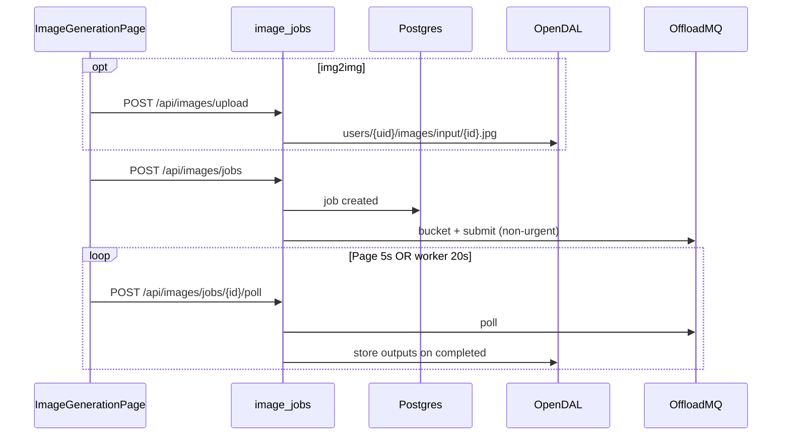

# OAI Image Generation — Engineering Context

End-user image pipelines at `/app/images`. **REST-only** (no WebSocket). OAI owns Postgres jobs, pipeline events, and **OpenDAL** file storage; **OffloadMQ** runs `imggen.*` tasks (submit + poll, buckets for img2img).

**Related:** SPA shell → `.claude/skills/oai-frontend/SKILL.md`. Chat + shared progress/debug → `.claude/skills/oai-chat/SKILL.md`.

---

## Running locally

```bash
# From oai/ — Postgres :5432, backend :3001, Vite :5174
task dev

task dev:backend
task dev:frontend
task kill
```

- Vite proxies `/api` → `http://localhost:3001`
- OffloadMQ URL + **client API token**: admin settings (`/app/settings/server`)
- JWT: `localStorage` `oai_token`; `` uses `imageFileUrl(id, token)` → `?token=`
- Backend starts **`image_pipeline_worker`** on boot (`main.rs`)
- Worker env: `IMAGE_PIPELINE_WORKER_TICK_SECS` (default **20**), `IMAGE_PIPELINE_WORKER_BATCH_SIZE` (default **20**)
- Needs **imggen agent** online on OffloadMQ with matching capability tags

---

## Architecture



**Layers:** Page poll advances a **viewed** job; background worker reconciles **all** in-flight (and completed-missing-output) jobs; progress drawer reads **DB snapshot** only (`GET /api/progress/running`).

---

## Routing

| Path | Component |
|------|-----------|
| `/app/images` | `ImageGenerationPage` |
| `/images` | redirect → `/app/images` |
| `/app/settings/worker-logs` | `ImageWorkerLogsPage` (admin) |

`AppShell` → `ProgressProvider` + `GlobalProgressDrawer` + `WorkloadProvider` (chat section separate).

---

## Frontend file map

| Path | Role |
|------|------|
| `frontend/src/pages/ImageGenerationPage.tsx` | Modes, form, submit, 5s auto-poll, job detail, cancel, ToolDebug |
| `frontend/src/components/imggen/ImageJobHistorySidebar.tsx` | Pipelines list; `IMGGEN_NEW_PANEL = 'new'` |
| `frontend/src/components/imggen/RescaleControls.tsx` | img2img `dataPreparation` (exact / max) |
| `frontend/src/components/imggen/PromptGeneratorModal.tsx` | LLM prompt generator (modal / mobile bottom sheet) |
| `frontend/src/api/promptgen.ts` | Prompt generator REST client |
| `frontend/src/lib/imggen.ts` | `rescaleDataPrep`, capability filter, pipeline UI helpers, `MODE_DEFAULTS` |
| `frontend/src/api/images.ts` | REST + `imageFileUrl()` |
| `frontend/src/hooks/useRunningImageJobs.ts` | Polls running jobs every **5s** |
| `frontend/src/contexts/ProgressContext.tsx` | Drawer + `refreshRunningImageJobs` |
| `frontend/src/components/GlobalProgressDrawer.tsx` | `cancelImageJob` on image rows |
| `frontend/src/components/ToolDebugModal.tsx` | Shared; raw OffloadMQ poll JSON |
| `frontend/src/pages/FilesPage.tsx` | `GET /api/files`; appends `?token=` to URLs |
| `frontend/src/pages/ImageWorkerLogsPage.tsx` | Admin worker pass logs |

### Page constants

- **UI terminal:** `completed`, `failed`, `canceled` — auto-poll stops
- **Non-terminal in UI:** `submitted`, `pending`, `running`, `cancelRequested`, etc.
- **Page poll:** `POLL_MS = 5000`
- **Submit response:** `{ job_id, status: "submitted" }`

### Submit guards (`canSubmit`)

- Non-empty prompt
- Capability starts with `imggen.`
- **img2img:** `uploadedInput` required

---

## Workflows: txt2img vs img2img

| Aspect | txt2img | img2img |
|--------|---------|---------|
| Defaults | 1024×1024 (`MODE_DEFAULTS`) | input-driven: original resolution (sub-4K) or proportional 1024 long edge; keep-proportions on |
| Upload | — | `POST /api/images/upload` |
| `workflow` | `"txt2img"` | `"img2img"` |
| `input_image_id` | null | from upload snowflake id |
| Offload buckets | output only | input (`rm_after_task=true`) + output |
| `data_preparation` | null from UI | `rescaleDataPrep()` → MQ map |

**`rescaleDataPrep`** (`lib/imggen.ts`):

| Mode | OffloadMQ value |
|------|-----------------|
| exact | `{ "*": "scale/{w}x{h}" }` |
| max | `{ "*": "scale/max[px=…,mp=…]" }` (needs px and/or mp) |
| disabled | `null` (omitted) |

**Task payload** (`build_submit_payload` in `image_jobs.rs`): `workflow`, `prompt`, `resolution`, optional `secondary_prompts.negative` (if `override_negative`), `seed`, `input_image` filename for img2img.

**Offload submit** (`offload/image_tasks.rs` `submit_img_task`): `urgent: false`, `file_bucket`, `output_bucket`, `dataPreparation`, `fetchFiles` for outputs.

**Capabilities:** prefix `imggen.` via `POST …/capabilities/list/online_ext`. Tags in brackets e.g. `[txt2img;img2img]` — `filterCapabilitiesByWorkflow` matches workflow; if none match, shows all caps.

**img2img resolution toggles** (page state, near Width/Height; helpers in `lib/imggen.ts`):

- **Original resolution** (`imggen-original-resolution`) — offered only when the input fits under 4K (`fitsOriginalResolution`, `FOUR_K_EDGE = 3840` on the larger edge). Default-**on** after upload/pick for sub-4K inputs. Locks Width/Height to the input's stored dims and submits with `data_preparation = null` (input passed through un-rescaled → output at original size). Hides the "Offload rescaling" advanced section while on.
- **Keep proportions** (`imggen-keep-proportions`) — offered for any img2img input; default-on whenever an input is present (implied + disabled while Original resolution is on). Locks the output aspect ratio to the input: editing one dimension recomputes the other (`proportionalCounterpart`, 8px grid), and the dimension presets become proportional variants (`proportionalPresets` over `PRESET_LONG_EDGES`). ≥4K inputs default to a proportional 1024 long edge (`proportionalSize`).
- `applyInputDefaults(img)` sets both toggles + dims on every input change (upload, library pick, send-to-img2img, mode switch); `applyPipelineParamsToNewForm` re-derives them on Edit prompt / retry.

---

## Prompt generator

"Prompt generator" button on the Prompt label row (`imggen-promptgen-open`) opens `PromptGeneratorModal` — centered dialog on desktop, bottom sheet on mobile (`useIsMobile` + DialogContent class overrides). It rewrites the user's rough idea into a polished prompt via a **text LLM** (`llm.*`, picked with `CapabilityModelPicker`).

- **Query template** must contain `{}` — replaced server-side with the idea. Templates are stored **per mode** in prompt-library buckets `imggen-promptgen-{mode}` (`PromptTextarea` recent/starred; recents recorded server-side on generate). Drafts also persist in `localStorage` (`oai_promptgen_query_{mode}`); model in `oai_promptgen_model`.
- **Flow:** `POST /api/promptgen/generate` `{ mode, capability, query, prompt }` → `{ cap, id }`; modal polls `POST /api/promptgen/poll` every **1.5s**; stop via generic `POST /api/tasks/cancel/{cap}/{id}`. Backend (`services/promptgen.rs`) validates, records the query, submits a non-urgent chat task (`maxWaitSecs 120`), and extracts the final text (`extract_llm_text`).
- **UI:** framer-motion morphing action element — Generate button → loader pill (with stop) → clickable generated-prompt variant (click = apply to form + close); Regenerate slides in below.

---

## REST API (Bearer)

| Method | Path | Notes |
|--------|------|-------|
| POST | `/api/images/upload` | multipart `file`; max **32MB** |
| POST | `/api/images/jobs` | `StartJobParams` → `{ job_id, status: "submitted" }` |
| GET | `/api/images/jobs` | last **50** jobs, full detail |
| GET | `/api/images/jobs/{id}` | job + files + events + offload ids |
| POST | `/api/images/jobs/{id}/poll` | poll MQ + persist + return outputs |
| POST | `/api/images/jobs/{id}/cancel` | **image-specific** cancel (updates DB) |
| GET | `/api/images/files/{id}` | bytes; JWT header or `?token=` |
| GET | `/api/images/capabilities` | empty if no client token |
| GET | `/api/progress/running` | DB-only list for drawer |
| POST | `/api/debug/offload_poll` | `{ cap, id }` raw MQ JSON |
| GET | `/api/files` | user file browser metadata |
| GET | `/api/promptgen/capabilities` | text LLMs (`llm.*`) for the prompt generator |
| POST | `/api/promptgen/generate` | `{ mode, capability, query, prompt }` → `{ cap, id }` |
| POST | `/api/promptgen/poll` | `{ cap, id }` → `{ status, stage?, text?, error? }` |

**Chat cancel** uses `POST /api/tasks/cancel/{cap}/{id}` — **not** for OAI job rows; images use **`/api/images/jobs/{id}/cancel`**.

### `StartJobParams` (JSON)

`capability`, `prompt`, `negative_prompt?`, `override_negative`, `width`, `height`, `seed?`, `workflow?`, `input_image_id?`, `data_preparation?` (map string→string).

---

## Job status transitions

### DB `image_generation_jobs.status`

| Status | Source |
|--------|--------|
| `created` | `create_job` |
| `submitted` | after OffloadMQ submit |
| MQ mirrors | `pending`, `running`, … from poll |
| `cancelRequested` | MQ cancel on running task |
| `completed` | outputs stored |
| `failed` / `canceled` | MQ terminal + `mark_failed` (`job.error` from `output.error`) |

**Service terminal:** `completed` \| `failed` \| `canceled` only (`is_terminal`).

### Poll handling (`poll_job` / worker)

| MQ status | Action |
|-----------|--------|
| `completed` | `fetch_and_store_outputs` |
| `failed` \| `canceled` | `mark_failed` |
| `cancelRequested` | update job status, keep polling |
| other | update job status to poll status |

### Pipeline events (`image_pipeline_events`)

Examples: `job.created`, `offload.output_bucket.create`, `offload.input.upload`, `offload.submit`, `offload.poll`, `worker.offload.poll`, `offload.cancel`, `download.outputs`, `job.finalize`.

**UI:** hides `offload.poll` / `worker.offload.poll` via `pipelineEventsWithoutPolls` (`POLL_EVENT_STEPS` in `imggen.ts`).

---

## Polling

| Layer | Interval | Behavior |
|-------|----------|----------|
| **ImageGenerationPage** | 5s | `POST …/poll` while active job non-terminal |
| **useRunningImageJobs** | 5s | `GET /api/progress/running` |
| **image_pipeline_worker** | 20s | `run_background_reconcile_pass` — poll in-flight + reconcile completed missing files |

**Running list:** `list_user_active_offload_tasks` — non-terminal jobs with offload row; display status prefers `task.last_poll_status` else `job.status`.

---

## Cancel

| UI | API |
|----|-----|
| Job detail `imggen-cancel-job` | `cancelImageJob` |
| Progress drawer `progress-cancel-image:{job_id}` | same |

Backend: `image_jobs::cancel_job` → `OffloadImageClient::cancel_task` → `update_job_status` with MQ response → event `offload.cancel`.

- Disabled until `selectedJob.offload_task_id` exists
- Fails if job already terminal
- Page: `refreshJob` + `runPoll` + `refreshRunningImageJobs` after cancel

---

## Debug (ToolDebug)

- `tool-debug-open` on job header when `toolDebugReady(offload_cap, offload_task_id)`
- `POST /api/debug/offload_poll` — `debug_offload.rs` uses **`chat_client`** + `poll_task_raw` (same API key as image pipeline)
- Output: pretty-printed **JSON** in `tool-debug-poll` (not YAML)

---

## Storage

| Kind | Path pattern |
|------|----------------|
| Upload input | `users/{user_id}/images/input/{image_id}.jpg` |
| Job output | `users/{user_id}/images/output/{job_id}/{image_id}.jpg` |
| Processing | `image_processing::process_image` — libvips; max edge **1920**, JPEG q=90; EXIF orientation baked in, EXIF stripped |

`imageFileUrl(imageId, token)` → `/api/images/files/{id}?token=…` for `` / links.

**Outputs:** if MQ returns multiple images, backend stores **last** image in list.

**Reconcile:** completed job without files → worker/user poll retries download; admin `POST …/reconcile`.

**libvips dependency:** `image_processing.rs` uses `rs-vips` (wraps libvips). Dev requires `brew install vips` (macOS) or `apt-get install libvips-dev` (Linux). Docker image installs `libvips42` in the runtime stage. `task dev` / `task build:backend` check for the system lib and fail fast with a hint if missing.

---

## Backend file map

| Path | Role |
|------|------|
| `backend/src/routes/images.rs` | Handlers + DTOs |
| `backend/src/services/image_jobs.rs` | Upload, start, poll, cancel, outputs, capabilities, worker pass |
| `backend/src/services/image_processing.rs` | Normalize bytes (no I/O) |
| `backend/src/db/image_generation.rs` | Jobs, files, events, offload tasks |
| `backend/src/offload/image_tasks.rs` | `OffloadImageClient` |
| `backend/src/services/offload_factory.rs` | `image_client` / `chat_client` |
| `backend/src/jobs/image_pipeline_worker.rs` | Background ticker |
| `backend/src/services/progress.rs` | Running jobs for drawer |
| `backend/src/routes/progress.rs`, `files.rs`, `admin.rs`, `debug.rs` | |
| `backend/src/routes/promptgen.rs` + `backend/src/services/promptgen.rs` | Prompt generator (LLM rewrite of the user's idea) |
| `backend/src/app.rs` | Route registration |

### DB tables

`image_generation_jobs`, `image_files`, `image_offload_tasks`, `image_pipeline_events`, `image_worker_logs`.

---

## Admin routes (admin middleware)

| Method | Path |
|--------|------|
| GET | `/api/admin/images/jobs` |
| GET | `/api/admin/images/jobs/{id}` |
| POST | `/api/admin/images/jobs/{id}/reconcile` |
| GET | `/api/admin/images/files` |
| GET | `/api/admin/images/events` |
| GET | `/api/admin/images/offload_tasks` |
| GET | `/api/admin/images/worker_logs` |

Frontend: `listImageWorkerLogs` in `api/admin.ts`; link from Settings `settings-worker-logs-link`.

---

## ProgressContext / GlobalProgressDrawer

- `useRunningImageJobs` → `runningImageJobs` (5s refresh)
- `TopBar` badge: chat running count + image running count
- Drawer image rows: key `image:{job_id}`; cancel → `cancelImageJob`
- `progress-refresh` reloads image list only (chat tasks are in-memory `WorkloadContext`)
- `ImageGenerationPage` calls `refreshRunningImageJobs()` after cancel

---

## data-testid reference

```
image-generation-page, imggen-pipelines-sidebar,
imggen-pipeline-new, imggen-pipeline-item-{job_id},
imggen-new-panel, imggen-mode-tabs, imggen-mode-img2img,
imggen-capability-select, imggen-input-section, imggen-upload-input,
imggen-rescale, imggen-prompt, imggen-negative-toggle,
imggen-promptgen-open, promptgen-modal, promptgen-idea, promptgen-query,
promptgen-reset-query, promptgen-insert-placeholder, promptgen-model-*,
promptgen-generate, promptgen-status, promptgen-stop,
promptgen-result, promptgen-regenerate, promptgen-error,
imggen-width, imggen-height, imggen-swap-dims, imggen-copy-from-input,
imggen-resolution-toggles, imggen-original-resolution, imggen-keep-proportions,
imggen-submit-job,
imggen-job-detail, imggen-poll-job, imggen-cancel-job,
imggen-pipeline, imggen-pipeline-toggle, imggen-pipeline-status,
tool-debug-open, tool-debug-modal, tool-debug-fetch-poll, tool-debug-poll,
progress-toggle, progress-drawer, progress-refresh,
progress-row-image:{job_id}, progress-cancel-image:{job_id}
```

---

## Common tasks

### Add a field to submit payload

1. `StartJobParams` in `image_jobs.rs` + `build_submit_payload`
2. `StartImageJobRequest` in `api/images.ts`
3. `ImageGenerationPage` form state + submit body
4. Agent capability schema on OffloadMQ side if needed

### Change rescale / dataPreparation

`RescaleControls.tsx` + `rescaleDataPrep` in `imggen.ts` — must match agent/sandbox glob→action convention.

### Debug stuck job

1. ToolDebug poll JSON
2. Job detail pipeline timeline (non-poll events)
3. Admin worker logs / reconcile
4. Check MQ agent + `imggen.*` capability online

### New pipeline event for UI

Record in `image_jobs.rs` via `record_event`; add to timeline unless poll noise (extend `POLL_EVENT_STEPS` if hiding).

---

## Pitfalls

1. **No WebSocket** — do not use `ws/` or `WorkloadContext` for image progress.
2. **`cancelRequested` is not UI-terminal** — auto-poll continues until `canceled`/`failed`/`completed`.
3. **Cancel needs offload row** — short window after submit.
4. **Capabilities empty** — missing client token or no `imggen.*` agents.
5. **Debug uses `OffloadClient` (chat factory)** — same MQ poll endpoint as images.
6. **Img2img rescale ≠ upload resize** — OAI normalizes upload to 1920px via libvips; MQ `dataPreparation` scales bucket files for the agent.
7. **Progress drawer does not poll MQ** — only DB; use page poll or worker for fresh state.
8. **No dedicated image itests** — admin 403 tests only; extend `oai/itests` when adding contract tests.
9. **libvips must be installed** — `image_processing.rs` links against the system libvips. Missing lib = linker error. Run `task install` or `brew install vips` before `task dev` or `cargo build`.

---

## Tests

- `oai/itests/tests/test_admin.py` — 403 on `/api/admin/images/jobs`, `/api/admin/images/files`
- No `test_images.py` yet — add when stabilizing REST contract
