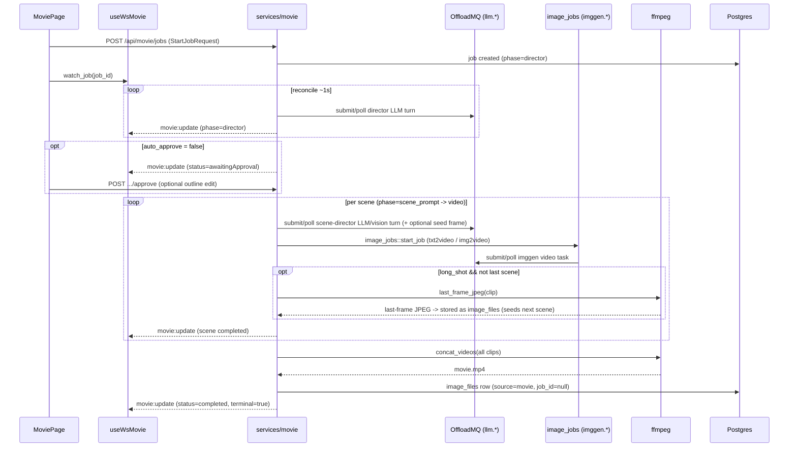

# OAI Movie Studio — Engineering Context

End-user multi-scene film generation at `/app/movie`. Composes patterns from two sibling
features rather than inventing new ones: state machine + REST + **WebSocket control plane**
like chat, and clip rendering through the same `imggen.*` pipeline (buckets, jobs, storage)
as image generation.

**Related:** SPA shell → `.claude/skills/oai-frontend/SKILL.md`. WS transport conventions,
`ServerEvent`/`ClientCommand` patterns → `.claude/skills/oai-chat/SKILL.md`. Video rendering,
buckets, `image_generation_jobs`, storage paths → `.claude/skills/oai-img/SKILL.md`.
**Full REST + WS contract, state machine detail, exact ffmpeg flags:**
[oai/docs/movie-studio.md](../../../oai/docs/movie-studio.md) — read that first for anything
touching the wire contract; this file is engineering context and pitfalls only.

---

## Running locally

```bash
# From oai/ — Postgres :5432, backend :3001, Vite :5174
task dev

task dev:backend
task dev:frontend
task kill
```

- Vite proxies `/api` (incl. WS) → `http://localhost:3001`
- OffloadMQ URL + client API token: admin settings (`/app/settings/server`)
- JWT: `localStorage` `oai_token`; WS uses `?token=` query param
- Backend starts **`movie_worker`** on boot (`main.rs`)
- Worker env: `MOVIE_WORKER_TICK_SECS` (default **10**), `MOVIE_WORKER_BATCH_SIZE` (default **20**)
- Needs both an **`llm.*`** agent (director + scene-director) and an **`imggen.*`** video-capable
  agent (`txt2video`/`img2video`) online on OffloadMQ
- **ffmpeg must be installed locally** — the backend shells out to it directly
  (`services/movie_ffmpeg.rs`, `Command::new("ffmpeg")`), same as `image_processing.rs` shells
  out to the `vipsthumbnail`/`vipsheader` CLI for image processing (neither links against a
  system lib at build time anymore). `oai/Taskfile.yml`'s `dev`, `dev:backend`, and
  `build:backend` tasks each run a `command -v ffmpeg` presence check (inline bash, right after
  the vips CLI check) and fail fast with an install hint if it's missing:
  - macOS: `brew install ffmpeg`
  - Linux: `apt-get install ffmpeg`
  - Already a Docker runtime dependency (see `oai/Dockerfile` — `apt-get install -y
    ca-certificates ffmpeg libvips-tools`), so production is covered regardless.

---

## Architecture



**Reconcile everywhere:** `reconcile_job` (the single state-machine entry point) is called by
the WS watch loop, the page's own `POST .../poll`, and `movie_worker`'s background pass — same
three-caller shape as `llm_debate`. It no-ops while `status` is terminal, `awaitingApproval`, or
`paused`.

---

## Routing

| Path | Component |
|------|-----------|
| `/app/movie` | `MoviePage` |

`AppShell` → same `WorkloadProvider` / `ProgressProvider` / `GlobalProgressDrawer` wrapping as
chat and images (Movie Studio's own in-flight state is carried by `useWsMovie`, not
`WorkloadContext` — it doesn't feed the global chat progress drawer).

---

## Frontend file map

Movie Studio's frontend is being built in parallel; some of these exist already, some don't yet
— check before assuming a file is present.

| Path | Role | Status at time of writing |
|------|------|------|
| `frontend/src/pages/MoviePage.tsx` | Main UI: idea form, outline/approval, scene timeline, WS subscriber | not yet created |
| `frontend/src/components/movie/MovieHistorySidebar.tsx` | Job list sidebar | exists |
| `frontend/src/components/movie/**` (other) | Scene cards, outline editor, approval panel, etc. | in progress |
| `frontend/src/hooks/useWsMovie.ts` | WS connect/reconnect, `send`, `subscribe`, `list_capabilities`/`watch_job` helpers | exists |
| `frontend/src/types/ws-movie.ts` | `MovieClientCommand` / `MovieServerEvent` (must match `backend/src/ws/events.rs`) | exists |
| `frontend/src/api/movie.ts` | REST client + `MovieJobView`/`SceneView`/`StartMovieJobRequest` types | exists |
| `frontend/src/lib/moviePromptBuckets.ts` | Prompt-library bucket name constants (`movie-idea`, `movie-director-system`, `movie-scene-system`) | exists |

---

## Backend file map

| Path | Role |
|------|------|
| `backend/src/services/movie.rs` | The state machine: `reconcile_job`, `start_job`, `approve`, `stop`, `resume`, `cancel_job`, `delete_job`, `MovieJobView`/`SceneView` |
| `backend/src/services/movie_ffmpeg.rs` | `last_frame_jpeg`, `concat_videos` — no DB/network I/O, pure `Command::new("ffmpeg")` wrappers |
| `backend/src/db/movie.rs` | SeaORM CRUD (`create_job`, `get_job`, `list_jobs`, `list_inflight_jobs`, `update_job_state`, `delete_job`) |
| `backend/src/db/entities/movie_jobs.rs` | `movie_jobs` table model |
| `backend/src/routes/movie.rs` | REST handlers + DTOs |
| `backend/src/ws/movie.rs` | WS upgrade, ping/idle, `MovieClientCommand` dispatch (transport only) |
| `backend/src/ws/events.rs` | `MovieClientCommand`, `ServerEvent::MovieCapabilities`/`MovieUpdate` (shared enum with chat/debate) |
| `backend/src/jobs/movie_worker.rs` | Background ticker (`MOVIE_WORKER_TICK_SECS`/`_BATCH_SIZE`) |
| `backend/src/app.rs` | Route registration — `/api/ws/movie` sits next to `/api/ws/debate`; `/api/movie/*` REST routes |

**DB table:** `movie_jobs` (migration `m20260730_000029_create_movie_jobs` in
`backend/src/db/migrator.rs`). One row per job; `outline_json` and `scenes_json` are
JSON-serialized `Vec<String>`/`Vec<SceneRecord>` columns, not separate tables.

---

## REST + WS contract

Fully documented in **[oai/docs/movie-studio.md](../../../oai/docs/movie-studio.md)** —
endpoint table, `StartJobRequest` fields, WS client/server event tables, `MovieJobView` and
`SceneView` field-by-field, storage paths. Do not duplicate those tables here; consult that doc
for exact field names before changing the contract on either side.

Quick orientation only:

- REST under `/api/movie/*`: `capabilities`, `jobs` (list/create), `jobs/{id}`
  (get/poll/delete), `jobs/{id}/approve`, `jobs/{id}/stop`, `jobs/{id}/resume`,
  `jobs/{id}/cancel`.
- WS at `/api/ws/movie`: `list_capabilities` → `movie_capabilities` (two lists: `llm`, `video`);
  `watch_job` → repeated `movie:update` until terminal.

---

## Common tasks

### Add a field to the job / scene shape

1. `SceneRecord`/`SceneView` or `MovieJobView` in `services/movie.rs` — plus `scene_view`/
   `job_view` mapping if adding to the view struct
2. `movie_jobs::Model` in `db/entities/movie_jobs.rs` + a new migration if it's a DB column
   (job-level fields only — scene fields live inside `scenes_json`, no migration needed)
3. `MovieJobView`/`SceneView` TS types in `frontend/src/api/movie.ts`
4. Update `oai/docs/movie-studio.md`'s shape blocks

### Change what happens in a phase

Edit the matching `reconcile_*` function in `services/movie.rs` (`reconcile_director`,
`reconcile_scene_prompt`, `reconcile_video`, `reconcile_assemble`). Keep `reconcile_job`'s
top-level terminal/awaitingApproval/paused guard intact — every phase function assumes it has
already been filtered out.

### Debug a stuck job

1. `GET /api/movie/jobs/{id}` — check `status`, `phase`, `offload_cap`/`offload_task_id` (or,
   in `video` phase, the current scene's `imggen_job_id`)
2. If `phase == video`, the real progress lives on the nested imggen job — use the same
   ToolDebug / admin worker-log tools as `oai-img` against that `imggen_job_id`
3. Check both an `llm.*` agent (director/scene-director) and the configured `imggen.*`
   video capability are online
4. Worker not advancing a `running` job → check `MOVIE_WORKER_TICK_SECS` and that the job isn't
   accidentally `awaitingApproval`/`paused` (the worker only picks up `status == "running"`,
   see `db::movie::list_inflight_jobs`)

---

## Pitfalls

1. **Outline edits on approve must match `scene_count` exactly.** `POST .../approve` with an
   `outline` array of the wrong length is rejected with 400 — the frontend must validate this
   before submitting, not rely on the backend error alone for UX.
2. **Resuming mid-render always restarts that scene's clip from scratch, never a completed
   one.** `resume` only resets the *current* scene if its own status isn't `"completed"` —
   earlier scenes are never touched. Don't expect partial-clip resume; the imggen job for the
   in-progress scene is discarded and a new one submitted.
3. **`stop` cancels different things depending on phase.** In `video` phase it cancels the
   nested imggen job; in `director`/`scene_prompt` phase it cancels the raw offload chat/vision
   task. Both are best-effort (errors are swallowed) — the job still transitions to `paused`
   even if the underlying cancel call fails.
4. **Long-shot continuity is only as good as the video capability's output format.** Last-frame
   extraction (`ffmpeg -sseof -0.3 ...`) assumes the rendered clip is a container/codec ffmpeg
   can seek and decode. A video capability whose output ffmpeg can't parse will fail the whole
   job at the last-frame-extraction step, not silently degrade to `txt2video`.
5. **ffmpeg is a runtime spawn, not a link dependency.** Even with the `task dev` presence
   check in place, a stale PATH or a container without ffmpeg fails at the first
   `movie_ffmpeg` call reached (last-frame extraction or concat) as an `AppError::Internal`
   spawn error — same failure mode as a missing `vipsthumbnail` in `image_processing.rs`,
   since neither is a build-time link dependency anymore.
6. **`movie_capabilities` has no explicit serde rename.** It serializes as `movie_capabilities`
   under the enum's default `rename_all = "snake_case"`, unlike most other movie/debate events
   which use an explicit `#[serde(rename = "...")]` with a colon (`movie:update`,
   `task:progress`). Don't assume every WS event follows the colon convention.
7. **Assembled movie and scene clips are different `image_files` rows.** Deleting a movie job
   removes only the assembled `movie.mp4` row; per-scene clips (and any long-shot last-frame
   images) belong to their own nested imggen job rows and are left alone. Don't expect a movie
   delete to clean those up.
8. **`retry` only works from `status == "failed"`, `resume` only from `"paused"` — they don't
   overlap.** Unlike `resume`, `retry` also clears the current scene's own `status`/`error`
   (a `director`/`scene_prompt` failure leaves that scene marked `"failed"`, which `stop` never
   produces), and always clears `job.error`. Same non-regeneration guarantee as `resume`:
   earlier `"completed"` scenes are never touched.

---

## Tests

No `oai/itests` coverage yet for `/api/movie/*` or `/api/ws/movie` — add `test_movie.py` when
stabilizing the REST contract, following the pattern in `oai/itests/tests/test_chats.py` /
`test_images.py`-equivalent admin tests. WS paths are manual-only for now, same as chat's WS
surface.
