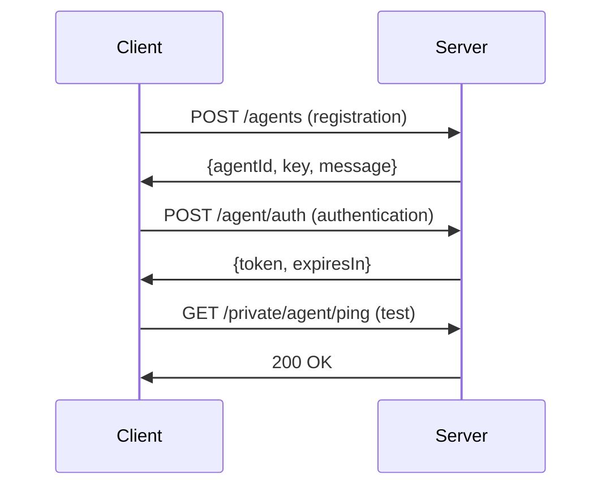

# 🚀 offloadmq Client script

A cross-platform Python client for registering agents with offload compute servers. Automatically detects system capabilities and handles authentication flow with JWT tokens.

Can be used as base for your custom offloadmq clients

## ✨ Features

- 🖥️ **Cross-platform system detection** - Works on Windows, macOS, and Linux
- 🎮 **Smart GPU detection** - Supports NVIDIA, AMD, and integrated graphics
- 🔐 **Automatic authentication** - Handles registration, JWT tokens, and renewal
- 💾 **Persistent configuration** - Saves settings to `.offload-client.json`
- 🔧 **Flexible capabilities** - Customize agent capabilities and performance tier
- 📊 **System information** - Automatically collects OS, CPU, memory, and GPU details
- ⚡ **Ready to use** - Simple command-line interface with sensible defaults

## 🛠️ Installation

1. **Clone or download** the script
2. **Install dependencies:**
   ```bash
   pip install -r requirements.txt
   ```

### Dependencies

- **Core** (required):
  - `requests` - HTTP client for server communication
  - `psutil` - Cross-platform system information

- **Optional** (for GPU detection):
  - `pynvml` - NVIDIA GPU detection
  - `GPUtil` - General GPU interface

## 🚀 Quick Start

### First Time Setup

Register your agent with the server:

```bash
python offload_client.py --server https://your-server.com --key your-api-key
```

### Advanced Configuration

```bash
python offload_client.py \
  --server https://your-server.com \
  --key your-api-key \
  --tier 8 \
  --caps "llm.mistral" "summarization" "translation" \
  --capacity 4
```

### Subsequent Runs

After initial setup, simply run:

```bash
python offload_client.py
```

The script will use saved configuration from `.offload-client.json`.

## 📋 Command Line Options

| Option | Default | Description |
|--------|---------|-------------|
| `--server` | *from config* | Server URL (required on first run) |
| `--key` | *from config* | API key (required on first run) |
| `--tier` | `5` | Performance tier (0-255, higher = better) |
| `--caps` | `["GENERAL_COMPUTE"]` | Agent capabilities |
| `--capacity` | `1` | Number of concurrent tasks |

### Capability Examples

Common capability strings:
- `llm.mistral-7b` - Large Language Model
- `llm.llama2-13b` - Specific model variant
- `text.generation` - Generic text generation
- `summarization` - Document summarization
- `translation.en-fr` - Language translation
- `image.processing` - Image analysis/editing
- `audio.processing` - Audio transcription/generation

## 🔧 Configuration File

The script maintains configuration in `.offload-client.json`:

```json
{
  "server": "https://your-server.com",
  "apiKey": "your-api-key",
  "agentId": "22550957-9deb-4c98-bbdc-2e7649684fe0",
  "key": "7e17cecc-3209-498b-9839-58da9990ef4f",
  "jwtToken": "eyJ0eXAiOiJKV1QiLCJhbGciOiJIUzI1NiJ9...",
  "tokenExpiresIn": 1755393572
}
```

## 🖥️ System Detection

The client automatically detects:

### Operating System
- **Windows**: `Windows 10 Pro`, `Windows 11 Home`
- **macOS**: `macOS 13.2.1`, `macOS 14.0`
- **Linux**: `Ubuntu 22.04.3 LTS`, `Fedora 38`, etc.

### Hardware
- **CPU Architecture**: `x86_64`, `arm64`, `i686`
- **Memory**: Total system RAM in MB
- **GPU**: Vendor, model, and VRAM (when available)

### GPU Support Matrix

| Platform | NVIDIA | AMD | Intel | Apple Silicon |
|----------|--------|-----|-------|---------------|
| Windows  | ✅ | ⚠️ | ⚠️ | N/A |
| macOS    | ✅ | ✅ | ✅ | ✅ |
| Linux    | ✅ | ⚠️ | ⚠️ | N/A |

✅ Full support &nbsp;&nbsp; ⚠️ Basic detection

## 📡 API Flow

The registration process follows this flow:



## 🔍 Example Output

```
Collecting system information...
OS: Ubuntu 22.04.3 LTS
Architecture: x86_64
Memory: 32768 MB
GPU: NVIDIA GeForce RTX 4090 (24576 MB VRAM)

Registering with server: https://compute.example.com
Capabilities: ['llm.mistral-7b', 'summarization']
Tier: 8
Capacity: 4

Registration successful!
Agent ID: 22550957-9deb-4c98-bbdc-2e7649684fe0
Message: Registered

Authenticating...
Authentication successful!
Configuration saved to .offload-client.json

Testing connection...
✅ Ping test successful - agent is ready!
```

## 🐛 Troubleshooting

### Common Issues

**GPU not detected:**
- Install optional dependencies: `pip install pynvml GPUtil`
- On Linux, ensure you have proper GPU drivers
- Script works fine without GPU - it will report `gpu: null`

**Permission errors on config file:**
- Ensure write permissions in current directory
- On some systems, run with appropriate user permissions

**Connection failures:**
- Verify server URL is correct and accessible
- Check firewall settings
- Ensure API key is valid

### Debug Information

For additional debug output, you can modify the script or check:
- Network connectivity: `ping your-server.com`
- Python version: `python --version`
- Installed packages: `pip list`

## 🤝 Contributing

Contributions welcome! Areas for improvement:
- Enhanced GPU detection for more vendors
- Better error handling and retry logic
- Configuration validation
- Logging system
- Docker containerization

## 📄 License

MIT License - see LICENSE file for details.

---

**Made with ❤️ for distributed computing**